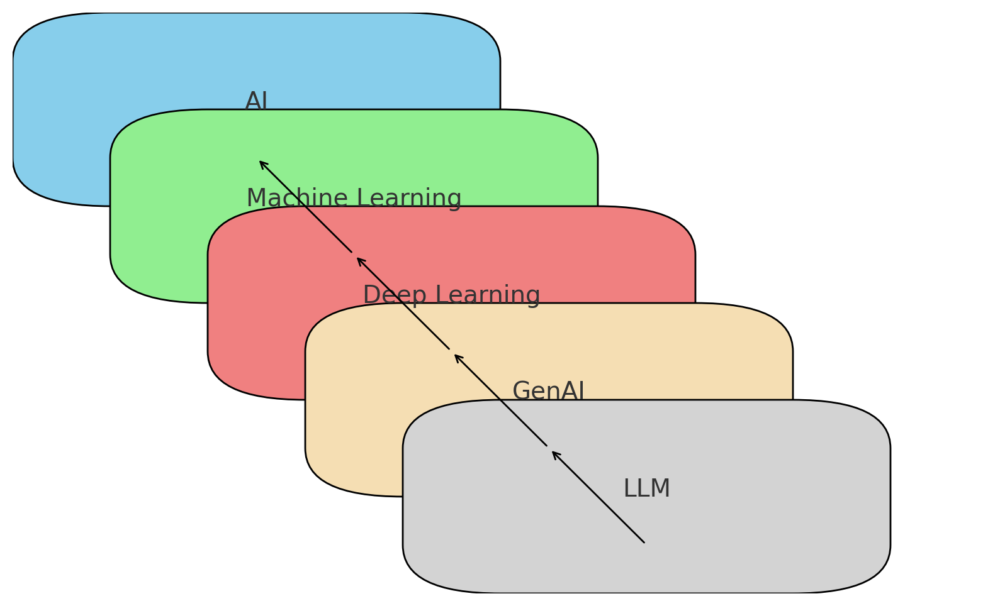

# Awesome-GenAI 
Welcome to Awesome-GenAI! This repository is a curated collection of resources, tools, frameworks, and information related to Generative AI. Whether you are a beginner looking to learn about the basics or an experienced developer searching for the latest advancements in the field, this repository aims to provide valuable insights and resources to help you on your journey.

_If you want to contribute to this list (please do), send me a pull request or contact me.
Also, a listed repository should be deprecated if:

* Repository's owner explicitly says that "this library is not maintained".
* Not committed for a long time (2~3 years).

Further resources:

* For a list of free GenAI books available for download, go [here](https://github.com/onebirdrocks/Awesome-GenAI/blob/main/books.md).
* For a list of (mostly) free GenAI courses available online, go [here](https://github.com/onebirdrocks/Awesome-GenAI/blob/main/courses.md).
* For a list of professional or free-to-attend meetups and local GenAI events, go [here](https://github.com/onebirdrocks/Awesome-GenAI/blob/main/events.md).

## What is Generative AI?
Generative AI refers to a class of AI algorithms that generate new content, such as text, images, and audio, based on the data they are trained on. These models can create realistic and innovative outputs, making them useful in various applications like content creation, design, and entertainment.

This diagram illustrates the hierarchical relationship between AI, Machine Learning, Deep Learning, GenAI, and LLM:
- **AI**  encompasses all technologies that simulate human intelligence.
- **Machine Learning** is a subset of AI, emphasizing learning from data and algorithms.
- **Deep Learning** is a subset of Machine Learning, utilizing multi-layer neural networks to handle complex data.
- **GenAI** (Generative AI) is an application of Deep Learning, focusing on generating new data.
- **LLM** (Large Language Models) is a branch of GenAI, specifically large-scale neural networks that generate and understand natural language text.

## Table of Contents
- Introduction
    - Overview of the project
    - Basic concepts of Generative AI
    - Contribution guidelines
- Learning Resources
    - Online courses
    - Books and papers
    - Tutorials
    - Workshops and conferences
- Tools and Frameworks
    - Development Frameworks
    - Open-source projects
- Models
    - Pre-trained models
    - Natural Language Processing models
    - Computer Vision models
    - Multimodal models
- Applications
    - Text generation
    - Image generation
    - Audio generation
    - Video generation
    - Other applications
- Datasets
    - Available datasets
    - Data collection and processing methods
    - Data augmentation techniques
- Research and Papers
    - Latest research updates
    - Important paper reviews
    - Research trends and hotspots
- Community and Events
    - Online and offline communities
    - Events and conferences
    - Projects and Case Studies
    - Success stories
    - Project showcases
    - Practical experience sharing
- Miscellaneous
    - Frequently Asked Questions
    - Useful tips
    - Recommended resources

 ## Learning Resources
 ### Paper
 - [Attention Is All You Need](https://arxiv.org/abs/1706.03762) - Most modern LLMs rely on the transformer architecture, which is a deep neural network architecture introduced in the 2017 paper "Attention Is All You Need"
 ### Tutorials 
 - [Let's build GPT: from scratch, in code, spelled out.](https://www.youtube.com/watch?v=kCc8FmEb1nY)

 ## Models
 ### Open Models 
- Meta
  - [Llama 3-8|70B](https://llama.meta.com/llama3/)
  - [Llama 2-7|13|70B](https://llama.meta.com/llama2/)
  - [Llama 1-7|13|33|65B](https://ai.facebook.com/blog/large-language-model-llama-meta-ai/)
  - [OPT-1.3|6.7|13|30|66B](https://arxiv.org/abs/2205.01068)
- Google
  - [Gemma2-9|27B](https://blog.google/technology/developers/google-gemma-2/)
  - [Gemma-2|7B](https://blog.google/technology/developers/gemma-open-models/)
  - [RecurrentGemma-2B](https://github.com/google-deepmind/recurrentgemma)
  - [T5](https://arxiv.org/abs/1910.10683)
- Microsoft
  - [Phi1-1.3B](https://huggingface.co/microsoft/phi-1)
  - [Phi2-2.7B](https://huggingface.co/microsoft/phi-2)
  - [Phi3-3.8|7|14B](https://huggingface.co/microsoft/Phi-3-mini-4k-instruct)
- Apple
  - [OpenELM-1.1|3B](https://huggingface.co/apple/OpenELM)
- Stability AI
  - [StableLM-3B](https://huggingface.co/collections/stabilityai/stable-lm-650852cfd55dd4e15cdcb30a)
  - [StableLM-v2-1.6|12B](https://huggingface.co/collections/stabilityai/stable-lm-650852cfd55dd4e15cdcb30a)
  - [StableCode-3B](https://huggingface.co/collections/stabilityai/stable-code-64f9dfb4ebc8a1be0a3f7650)
- DataBricks
  - [MPT-7B](https://www.databricks.com/blog/mpt-7b)
  - [DBRX-132B-MoE](https://www.databricks.com/blog/introducing-dbrx-new-state-art-open-llm)
- Alibaba
  - [Qwen-1.8|7|14|72B](https://huggingface.co/collections/Qwen/qwen-65c0e50c3f1ab89cb8704144)
  - [Qwen1.5-1.8|4|7|14|32|72|110B](https://huggingface.co/collections/Qwen/qwen15-65c0a2f577b1ecb76d786524)
  - [CodeQwen-7B](https://huggingface.co/Qwen/CodeQwen1.5-7B)
  - [Qwen-VL-7B](https://huggingface.co/Qwen/Qwen-VL)
  - [Qwen2-0.5|1.5|7|57-MOE|72B](https://qwenlm.github.io/blog/qwen2/)

## Tools & Frameworks
### Development Frameworks
- [Langchain](https://langchain.com) - LangChain is a framework to build with LLMs by chaining interoperable components. LangGraph is the framework for building controllable agentic workflows.
- [LamaIndex](https://www.llamaindex.ai/) - LlamaIndex is a simple, flexible data framework for connecting custom data sources to large language models.
- [Flowise](https://flowiseai.com/) - Open source low-code tool for developers to build customized LLM orchestration flow & AI agents
- [Auto-GPT](https://autogpt.net/) - Auto-GPT is a software program that allows you to configure and deploy autonomous AI agents and aims to transform GPT-4 into a fully autonomous chatbot. While LangChain is a toolkit that connects various LLMs and utility packages to create customized applications, Auto-GPT is designed to execute codes and commands to deliver specific goal-oriented solutions with an output that's easy to understand. While impressive, at this stage, Auto-GPT has a tendency to get stuck in infinite logic loops and rabbit holes.
- [AgentGPT](https://agentgpt.reworkd.ai/) - AgentGPT is designed for organizations that wish to deploy autonomous AI agents in their browsers. While Auto-GPT operates independently and generates its own prompts, Agent GPT depends on user inputs and works by interacting with humans to achieve tasks. Though still in the beta stage, AgentGPT currently provides long-term memory and web browsing capabilities.
- [BabyAGI](https://github.com/yoheinakajima/babyagi) - BabyAGI is a Python script that acts as an AI-powered task manager. It uses OpenAI, LangChain, and vector databases, such as Chroma and Pinecone, to create, prioritize, and execute tasks. It does this by selecting a task from a list and sending the task to an agent, which uses OpenAI to complete the task based on context. The vector database then enriches and stores the result. BabyAGI then goes on to create new tasks and reprioritizes the list according to the result and objective of the previous task.
- [Langdock](https://www.langdock.com/) -  Empower your employees with LLMs while staying in full control of your data. Chat with your internal knowledge, automate workflows, and build custom assistants. LangDock was built for developers searching for an all-in-one product suite for creating, testing, deploying, and monitoring their LLM plugins. It lets you add your API documentation manually or import an existing OpenAPI specification.

### Open-source projects
